# Learn Harness by Example

<p align="center">
  <a href="LICENSE.md"></a>
  <a href="LICENSE.md"></a>
  <a href="https://maxliux5.github.io/learn-harness-by-example/"></a>
  <a href="ROADMAP.md"></a>
  <a href="cases/failure_corpus.json"></a>
  <a href="pyproject.toml"></a>
  <a href="examples/minimax_smoke.py"></a>
</p>

Build the debugging, eval, and replay shell every serious agent eventually needs.

Most agent tutorials stop at a charming demo: prompt goes in, answer comes out. The hard part starts later, when nobody can explain whether the agent used tools, why the answer changed, which prompt broke the run, or why an eval score went up while the behavior got worse.

This course builds a small research-agent harness from scratch. No framework dependency. No API key. Every chapter leaves behind runnable code, trace artifacts, eval cases, or reusable prompts you can carry into your own agent project.

The tutorial chapters are written in Chinese, with core engineering terms such as Harness, Trace, Eval, Replay, Provider, and Tool kept in English.

> **The thesis:** Agent engineering is not only about getting smarter answers. It is about making every run inspectable enough that a team can debug, compare, and improve it.

## Quick Navigation

[Read the site](https://maxliux5.github.io/learn-harness-by-example/) · [Start with the failure](#start-with-the-failure) · [Run locally](#getting-started) · [Roadmap](ROADMAP.md) · [Chapter template](CHAPTER_TEMPLATE.md) · [Failure corpus](cases/failure_corpus.json) · [Reusable outputs](outputs/) · [Contribute](CONTRIBUTING.md)

## What You Build

| Layer | What you implement | Why it matters |
| --- | --- | --- |
| Agent loop | `Agent.run(task)` with a fixed control flow | Gives the project one place to reason about behavior |
| Provider boundary | `ModelClient`, deterministic doubles, and optional MiniMax | Lets you test offline, then smoke-test a real model |
| Tools | `Tool` definitions, args, return values, errors | Makes external evidence visible instead of magical |
| State | `RunState` with messages, answer, errors, trace | Turns one run into a durable object |
| Trace | `TraceEvent` timeline | Shows what happened before the final answer |
| Eval | Text checks plus trace assertions | Catches false positives that keyword eval misses |
| Replay | Saved run records and version comparison | Makes prompt/model/tool changes reviewable |
| Failure corpus | 9 messy scenarios | Teaches debugging from real failure shapes |

## Start With The Failure

Run the chapter 00 case study first:

```bash
python3 examples/ch00_case_study.py
```

It creates a realistic false positive. The answer contains the right words, so a keyword-only eval passes. But the trace has no `tool.called` and no `tool.returned`, so the evidence-aware eval fails.

```json
{
  "keyword_only_passed": true,
  "evidence_eval_passed": false,
  "missing_trace": ["tool.called", "tool.returned"]
}
```

That is the course in miniature: do not only evaluate the final text. Evaluate whether the agent walked the behavior path the task required.

The script writes the full report to [traces/case-study-report.json](traces/case-study-report.json).

## The Shape Of The Course

The chapters stack from one idea to the next. You can skim, but the dependencies are intentional.

```mermaid
flowchart LR
  C00["00 Failure Case"] --> C01["01 Why Harness"]
  C01 --> C02["02 Agent Loop"]
  C02 --> C03["03 Model Provider"]
  C03 --> C04["04 Tools"]
  C04 --> C05["05 Run State"]
  C05 --> C06["06 Trace"]
  C06 --> C07["07 Eval"]
  C07 --> C08["08 Failure-Driven"]
  C08 --> C09["09 Replay"]
  C09 --> C10["10 Minimal Project"]
```



Each chapter follows the same contract:

1. A concrete agent failure or design pressure.
2. The smallest code that exposes the idea.
3. The run output you should inspect.
4. The trace/eval signal that tells you what changed.
5. A checkpoint you can use to explain the concept back.

## Getting Started

Three ways in. Pick one.

**Option A: read online.**

[Open the GitHub Pages site](https://maxliux5.github.io/learn-harness-by-example/). The root URL redirects to the full tutorial in `docs/`.

**Option B: clone and run the core path.**

```bash
git clone https://github.com/maxliux5/learn-harness-by-example.git
cd learn-harness-by-example
python3 examples/ch00_case_study.py
python3 -m harness run --scenario happy_path
python3 -m harness diagnose
python3 -m unittest discover tests
```

**Option C: install the tiny CLI.**

```bash
python3 -m pip install -e .
learn-harness diagnose
learn-harness run --scenario eval_false_positive --no-save
```

All examples use the Python standard library. The default model is a deterministic scenario double, so you do not need an API key to learn the harness mechanics.

**Option D: run a real MiniMax provider smoke test.**

The real provider uses MiniMax's OpenAI-compatible chat completions API. Set one env var, then run the same harness against a live model:

```bash
export MINIMAX_API_KEY=...
python3 -m harness run --provider minimax --model MiniMax-M2.7 --output traces/minimax/latest-run.json
python3 examples/minimax_smoke.py
```

Supported env vars:

| Env var | Default | Purpose |
| --- | --- | --- |
| `MINIMAX_API_KEY` | required for real provider | Bearer token |
| `MINIMAX_MODEL` | `MiniMax-M2.7` | Model name |
| `MINIMAX_BASE_URL` | `https://api.minimax.io/v1` | OpenAI-compatible base URL |
| `MINIMAX_TIMEOUT` | `60` | HTTP timeout in seconds |
| `MINIMAX_RETRIES` | `1` | Retry count for transient failures |

The real path still uses the local `search` tool first, then calls MiniMax to synthesize the final answer from tool evidence. This keeps the tutorial's key invariant intact: even a live model run should leave `tool.called`, `tool.returned`, and `run.completed` in the trace.

## Every Chapter Ships Something

This is not only a reading path. The repo contains artifacts you can reuse:

| Artifact | Path | Use it for |
| --- | --- | --- |
| Runnable chapter scripts | [examples/](examples/) | Learn one concept at a time |
| Real provider smoke test | [examples/minimax_smoke.py](examples/minimax_smoke.py) | Verify the harness with MiniMax |
| Reusable harness package | [harness/](harness/) | Fork into a starter agent project |
| Failure corpus | [cases/failure_corpus.json](cases/failure_corpus.json) | Regression cases for messy agent behavior |
| Trace and replay records | [traces/](traces/) | Examples of inspectable run artifacts |
| Trace debugger prompt | [outputs/prompt-trace-debugger.md](outputs/prompt-trace-debugger.md) | Ask an assistant to diagnose a run record |
| Failure-to-eval prompt | [outputs/prompt-failure-to-eval.md](outputs/prompt-failure-to-eval.md) | Turn a bad run into an eval case |
| Harness reviewer skill | [outputs/skill-agent-harness-reviewer.md](outputs/skill-agent-harness-reviewer.md) | Review whether an agent has real harness depth |

## Worked Sample

Chapter 00 compares a false-positive run to a fixed run.

| False positive | Improved |
| --- | --- |
| `run.started` | `run.started` |
| `model.called` | `model.called` |
| `model.returned` | `model.returned` |
| `run.completed` | `tool.called` |
|  | `tool.returned` |
|  | `model.called` |
|  | `model.returned` |
|  | `run.completed` |

The answer changed, but the important part is the behavior changed: the improved run has evidence events. That is why the replay diff reports:

```json
{
  "answer_changed": true,
  "tool_call_delta": 1,
  "completed_delta": 0
}
```

## Failure Corpus

The failure corpus is the spine of the tutorial. It includes:

- no tool call
- wrong tool args
- missing tool args
- empty tool result
- hallucinated citation
- max-step loop
- schema drift
- provider timeout
- eval false positive

Run all cases:

```bash
python3 -m harness diagnose
```

`detected/total` means the harness caught the failure signal. It does not mean the failed scenario was good. This distinction is important: a debugging harness should make bad behavior visible before it tries to make the behavior disappear.

## Repository Map

```text
.
├── docs/                  # GitHub Pages tutorial site
├── examples/              # One runnable script per chapter
├── harness/               # Minimal reusable agent harness package
├── cases/                 # Failure corpus and diagnosis rules
├── traces/                # Trace, eval, replay, and case-study artifacts
├── outputs/               # Reusable prompts and skill artifacts
├── tests/                 # Standard-library unittest coverage
├── ROADMAP.md             # Chapter status, estimates, and proof commands
├── CHAPTER_TEMPLATE.md    # Contribution template for future chapters
└── .github/workflows/     # GitHub Pages deployment
```

## Contents

| # | Chapter | Run | Ships |
| --- | --- | --- | --- |
| 00 | [案例导读：一次失败如何暴露 Harness 的必要性](docs/chapters/00-case-study.md) | `python3 examples/ch00_case_study.py` | case-study report |
| 01 | [为什么 Agent 需要 Harness](docs/chapters/01-why-harness.md) | `python3 examples/ch01_why_harness.py` | minimal trace |
| 02 | [第一个最小 Agent Loop](docs/chapters/02-minimal-loop.md) | `python3 examples/ch02_minimal_loop.py` | `Agent.run(task)` |
| 03 | [把模型 Provider 抽象出来](docs/chapters/03-model-provider.md) | `python3 examples/ch03_model_provider.py` | `ModelClient` boundary |
| 04 | [给 Agent 增加工具](docs/chapters/04-tools.md) | `python3 examples/ch04_tools.py` | tool call events |
| 05 | [管理一次运行的状态](docs/chapters/05-run-state.md) | `python3 examples/ch05_run_state.py` | `RunState` |
| 06 | [加入 Trace 和可观测性](docs/chapters/06-trace-observability.md) | `python3 examples/ch06_trace_observability.py` | structured trace |
| 07 | [从 Demo 走向 Eval](docs/chapters/07-eval.md) | `python3 examples/ch07_eval.py` | eval report |
| 08 | [失败案例驱动改进](docs/chapters/08-failure-driven.md) | `python3 examples/ch08_failure_driven.py` | failure checks |
| 09 | [Replay、对比和版本化](docs/chapters/09-replay-compare.md) | `python3 examples/ch09_replay_compare.py` | replay records |
| 10 | [整理成一个最小 Harness 项目](docs/chapters/10-final-project.md) | `python3 examples/ch10_research_harness.py` | reusable package + MiniMax provider |

## Quality Bar

This tutorial is ready to grow only if new chapters preserve these properties:

- The code runs without external services by default.
- The chapter teaches one engineering pressure, not a bag of tips.
- The run output gives the reader something concrete to inspect.
- The trace/eval signal explains what changed.
- The chapter ships an artifact: script, trace, eval case, replay record, prompt, or package code.

See [CHAPTER_TEMPLATE.md](CHAPTER_TEMPLATE.md) and [CONTRIBUTING.md](CONTRIBUTING.md) before adding new material.

## Who This Is For

| You are | Start at | Goal |
| --- | --- | --- |
| New to agents | Chapter 00 | See why demos are not enough |
| Building a tool-using agent | Chapter 04 | Add evidence-producing tools |
| Adding evals | Chapter 07 | Move beyond keyword-only checks |
| Debugging regressions | Chapter 08 | Turn failures into cases |
| Forking a starter project | Chapter 10 | Reuse the `harness/` skeleton |

## License

Code examples use the MIT License. Tutorial text and visual/documentation content use Creative Commons Attribution 4.0 International.
